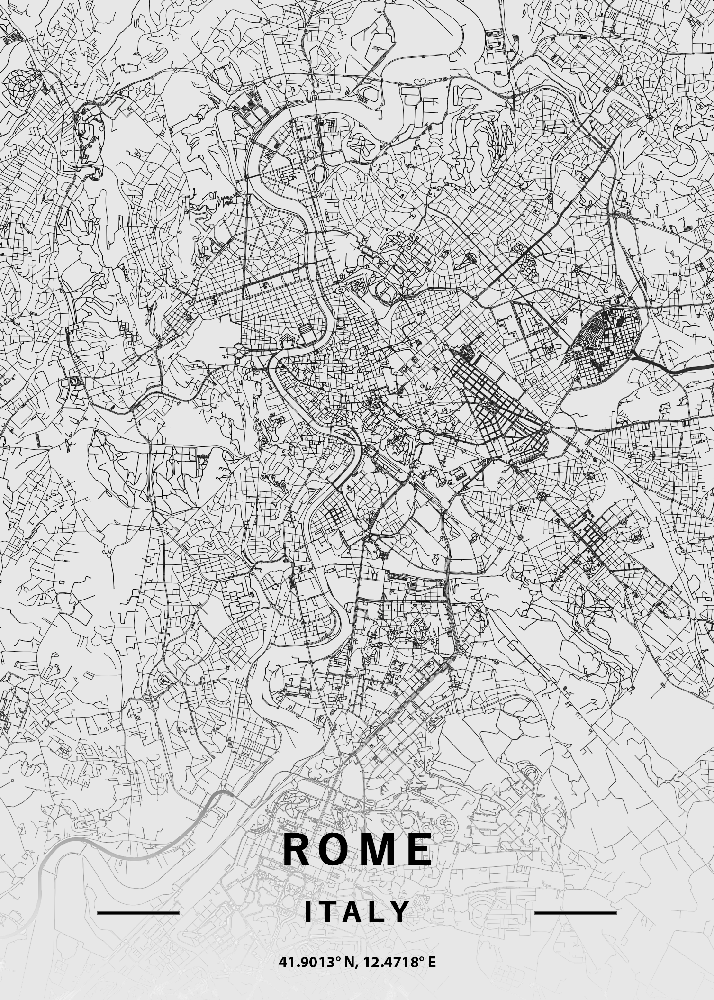

# rome-osmnx-map
An edited map of the Italian capital, using OSMnx street network library.

A 20 x 20 km map of Rome has been rendered by the use of [OSMnx](https://github.com/gboeing/osmnx) library in Python. To achieve the final result some of the edges have been cut off. The text was added using Adobe Photoshop and Lightroom.



The raw image from Python.


The content of the jupyter notebook:
```Python
import osmnx as ox
from IPython.display import Image
%matplotlib inline
ox.config(log_console=True, use_cache=True)

point = (41.901336, 12.471831)
fig, ax = ox.plot_figure_ground(point=point, dist=10000, network_type='all', default_width=1, figsize=(50,50))
```

Ideas and refernce:
- [statsmapsnpix](http://www.statsmapsnpix.com/2020/10/10x10km-city-squares.html)
- [geoffboeing](https://geoffboeing.com/2016/11/osmnx-python-street-networks/#:~:text=OSMnx%20is%20a%20Python%20package,easily%20analyze%20and%20visualize%20them.)
